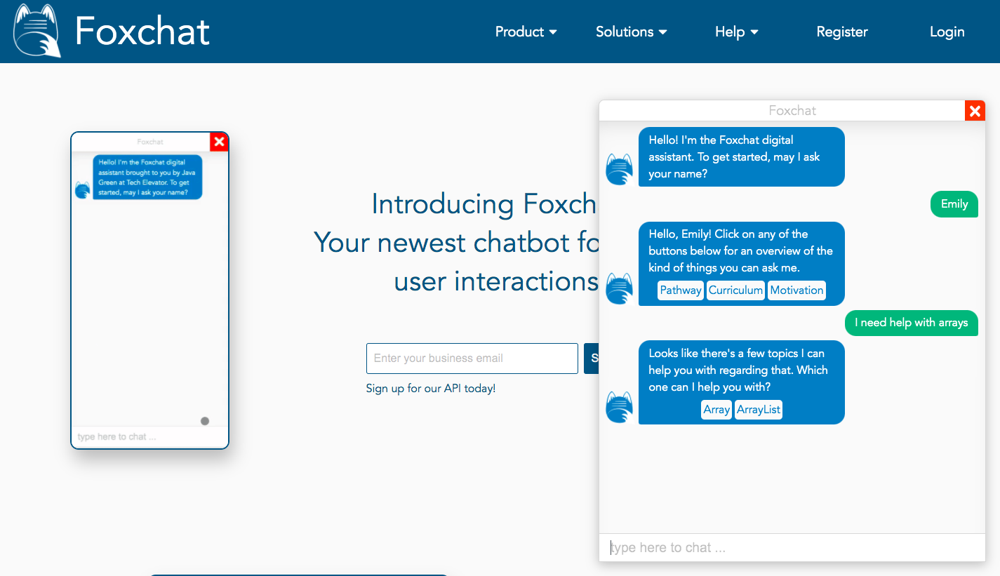
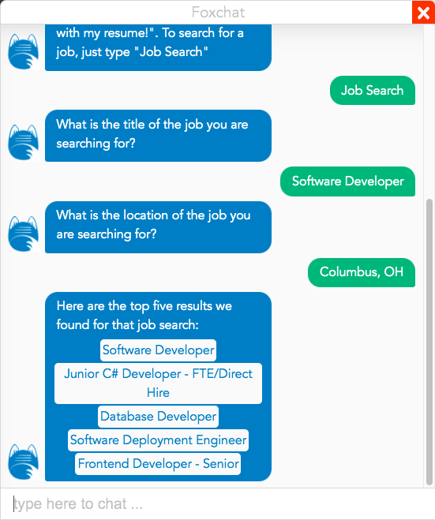
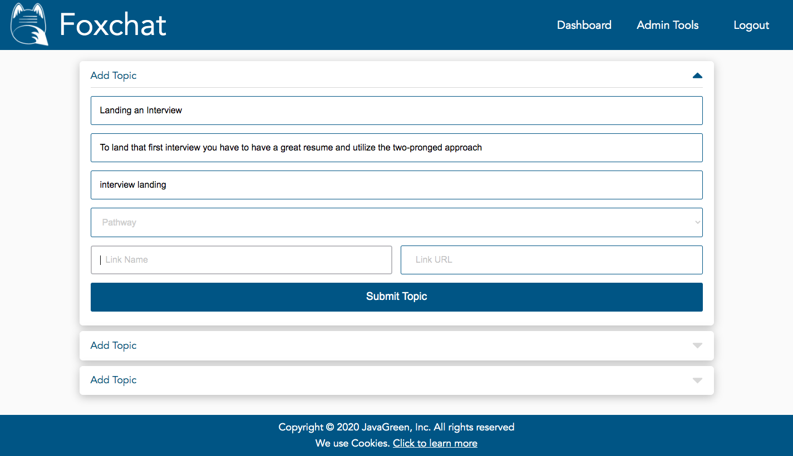
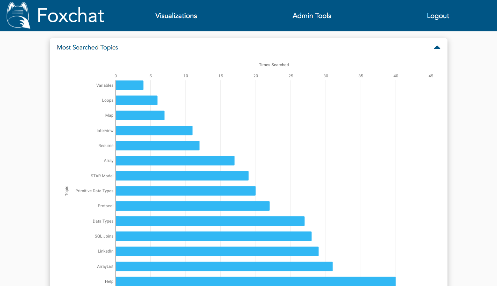
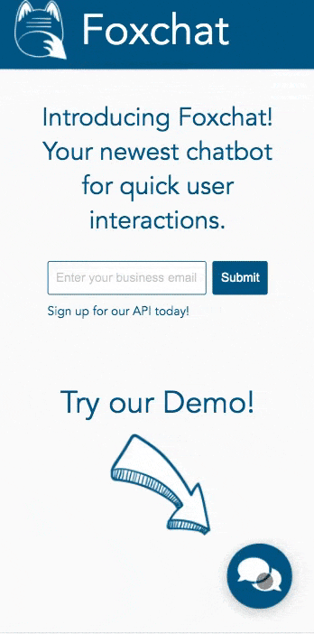

<p align="center">

</p>

# FoxChat - Education Help Chatbot

The FoxChat project is two things: the chatbot itself, designed around the Tech Elevator curriculum to help students get answers to questions they may have about academic topics as well as Pathway (interviews, job search, networking skills) topics, and the selling page, designed with expansion in mind and highlighting the ability to customize the chatbot to whatever business needs might find a chatbot useful. 


## Getting Started

As of the time of writing, this project is not designed to be run independently or to be a client-facing application just yet. However, if you'd like to build the project to run on your local machine, here are the steps:


### Prerequisites
1. A Java IDE such as [Eclipse](https://www.eclipse.org/)
2. A JS/HTML editor such as [Visual Studio Code](https://code.visualstudio.com/)
3. A database management software such as [DB Visualizer](https://www.dbvis.com/)
4. [PostgreSQL](https://www.postgresql.org/)
5. [Node.js / npm](https://www.npmjs.com/get-npm)


### Installation

1. Clone this repository to your local machine or download it.
2. Navigate to the <a href="java/database">java/database</a> folder and run the create.sh shell script to create the database.
3. Open the java folder in the IDE of your choice and run Application.java. (This should start your server API)
4. Open the vue folder in Visual Studio Code or equivalent.
5. Open Terminal and run 
```
npm install
```
and then 
```
npm run serve
```

6. Navigate to http://localhost:8081/ and start interacting with FoxChat!

## Usage

* Ask FoxChat questions about the curriculum of Tech Elevator or Pathway advice on finding a job.


* Search for jobs on Indeed


* Create an account and log in to view the Admin tools and see usage data.



* View it on a small screen for a unique mobile experience.



## Running the tests

The tests for this program were written in Java utilizing the junit dependency. To run the tests, you can run any of the classes within the src/test/java folder. Each class is responsible for testing the relevant methods in the application's corresponding classes. 

## Contributors
* [Kolton Nay](https://www.linkedin.com/in/koltonnay/) Specialty: Java Web Services
* [Jay Roever](https://www.linkedin.com/in/jayroever/) Specialty: Vue.js + CSS
* [Mark Seymour](https://www.linkedin.com/in/mark-a-seymour/) Speciality: PostgreSQL


## Built With
* [Eclipse](https://www.eclipse.org/) - IDE
* [Visual Studio Code](https://code.visualstudio.com/) - Code Editor
* [DB Visualizer](https://www.dbvis.com/) - Database Management
* [Maven](https://maven.apache.org/) - Dependency Management
* [JUnit](https://junit.org/) - Testing
* [Vue.js](https://vuejs.org/) - Front-End Development
* [PostgreSQL](https://www.postgresql.org/) - Database
* [Node.js / npm](https://nodejs.org/en/) - Package Management


